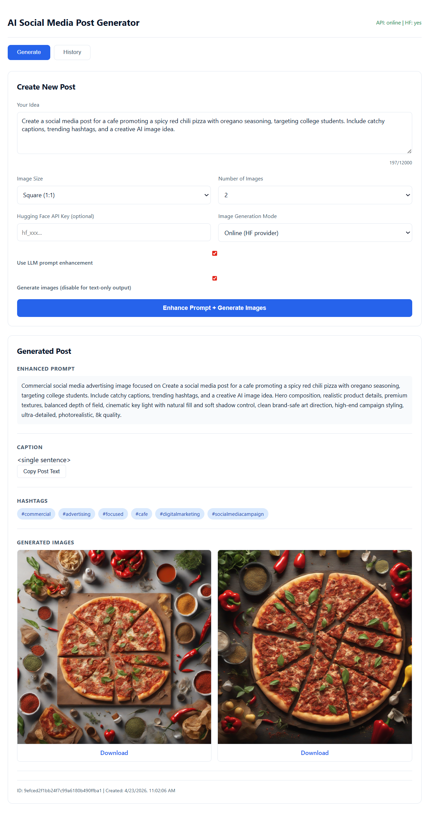

# AI Social Media Post Generator

AI Social Media Post Generator is a full-stack application for creating social media content from a single idea. It generates an enhanced prompt, caption, hashtags, and AI images in one flow.

## Project Overview

Marketing teams often spend significant time on ideation, copywriting, and visual generation for each post. This project streamlines that workflow by combining prompt engineering, caption generation, hashtag extraction, and image generation in one interface.

## Key Features

- Prompt enhancement with marketing context
- Caption generation with hashtag extraction
- AI image generation with multiple aspect ratios (`1:1`, `4:5`, `16:9`)
- End-to-end post generation API (`/generate-post`)
- Saved generation history with retrieval and deletion
- Dockerized frontend and backend deployment

## Sample Output

The image below shows a generated post result from the application UI:



## Technology Stack

### Backend
- Python 3.11+
- FastAPI
- Hugging Face Inference API
- Local JSON and PNG storage

### Frontend
- React
- Vite
- ESLint
- Custom CSS UI

### Optional Client
- Streamlit (`streamlit_app.py`)

## Running with Docker (Recommended)

Start the full application:

```bash
docker compose up --build
```

Available services:
- Frontend: `http://localhost:5173`
- Backend API: `http://localhost:8000`
- API Docs: `http://localhost:8000/docs`

Stop the application:

```bash
docker compose down
```

## Local Development

### Backend
```bash
cd backend
pip install -r requirements.txt
uvicorn api_gateway.main:app --reload
```

### Frontend
```bash
cd frontend
npm install
npm run dev
```

### Streamlit (Optional)
```bash
streamlit run streamlit_app.py
```

## API Endpoints

| Method | Endpoint | Description |
|--------|----------|-------------|
| GET | `/health` | Service health and diagnostics |
| POST | `/enhance-prompt` | Enhance user prompt |
| POST | `/generate-caption` | Generate caption and hashtags |
| POST | `/generate-images` | Generate images from prompt |
| POST | `/generate-post` | Generate full post output |
| GET | `/history` | List saved generations |
| DELETE | `/delete/{id}` | Delete a saved generation |

## Configuration

Create or update `backend/.env`:

```env
HF_TOKENS=your_huggingface_token_here
```
